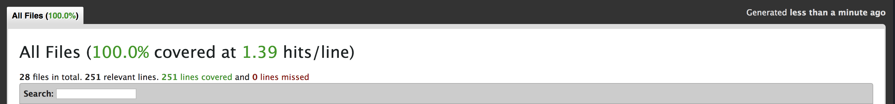

# Summit Register (Back End)

Visit the deployed API here: https://summit-register-api.herokuapp.com/


**Front End**

  Visit the front end github repo here: https://github.com/christopherchateau/summit-register-FE

  Visit the front end deployed site here: https://summit-register.herokuapp.com/

###### Core Contributors
  - Chris Chateau | github.com/christopherchateau
  - Andrew Mockett | github.com/MacInnes
  - Justin Stewart | github.com/JStewart3313
  - Andrew Tobin | github.com/andrewetobin

## Setup

- Fork or clone this repo: `https://github.com/MacInnes/summit-register-BE`
- Run `bundle update`
- Run `rake db:{create,migrate,seed}`
- Run `rails s` to spin up the server
- Visit `localhost:3000` in your browswer.

## Testing
- Run the test suite with `rspec`
- Current test report:


## Endpoints

**GET `/api/v1/mountains`**
 - This will provide a list of all mountains and their attributes, in the database .

Example Response:
```json
{
    "data": [
      {
          "id": "1",
          "type": "mountain",
          "attributes": {
              "name": "Mt. Elbert",
              "altitude": 14433,
              "summit": "39.118075,-106.445417",
              "difficulty": "Blue",
              "range": "Sawatch",
              "registries": {
                  "data": []
              }
          }
      },
      {
          "id": "2",
          "type": "mountain",
          "attributes": {
              "name": "Mt. Massive",
              "altitude": 14421,
              "summit": "39.187298,-106.475548",
              "difficulty": "Blue",
              "range": "Sawatch",
              "registries": {
                  "data": []
              }
          }
      },
      {
          "id": "3",
          "type": "mountain",
          "attributes": {
              "name": "Mt. Harvard",
              "altitude": 14420,
              "summit": "38.924328,-106.320618",
              "difficulty": "Blue",
              "range": "Sawatch",
              "registries": {
                  "data": []
              {
          }
      }
   ]
}

```

**GET `/api/v1/mountains/:id`**
- Provides data for a specific mountain, including its registries.
Example Response:
```json
{
    "data": {
        "id": "1",
        "type": "mountain",
        "attributes": {
            "name": "Mt. Elbert",
            "altitude": 14433,
            "summit": "39.118075,-106.445417",
            "difficulty": "Blue",
            "range": "Sawatch",
            "registries": {
                "data": [
                    {
                        "id": "1",
                        "type": "registry",
                        "attributes": {
                            "name": "Phillip Nylander",
                            "hometown": "Boulder",
                            "comments": "My first 14er ever!",
                            "date": "2018-12-19 21:10:17 UTC"
                        }
                    },
                    {
                        "id": "2",
                        "type": "registry",
                        "attributes": {
                            "name": "Jennifer Bevans",
                            "hometown": "Pueblo",
                            "comments": "I can see forever.",
                            "date": "2018-12-19 21:11:29 UTC"
                        }
                    }                   
                ]
            }
        }
    }
}
```

**POST `/api/v1/mountains/:id/registries`**
- Adds a registry to the database.

Expected Request Format:
```
{
      name: "Michael Smith",
      hometown: "Omaha, NE",
      comments: "I can see my house",
      mountain_id: 1
    }
```

Example Response:
```
{:data=>
  [{:id=>"4",
    :type=>"registry",
    :attributes=>
     {:name=>"Carter Beauford", :hometown=>"Charlottesville, VA", :comments=>"Great hike", :date=>"2018-12-21 01:23:10 UTC"}},
   {:id=>"5",
    :type=>"registry",
    :attributes=>
     {:name=>"Jeff Coffin",
      :hometown=>"Nashville, TN",
      :comments=>"Hi Mom",
      :date=>"2018-12-21 01:23:10 UTC"}},
   {:id=>"7",
    :type=>"registry",
    :attributes=>
     {:name=>"Michael Smith",
      :hometown=>"Omaha, NE",
      :comments=>"I can see my house",
      :date=>"2018-12-21 01:23:10 UTC"}}]}
```

*An error will produce:*
- The post request will error if one of the Registry parameters are missing.
```
{:message=>"Invalid request, missing required parameters."}
